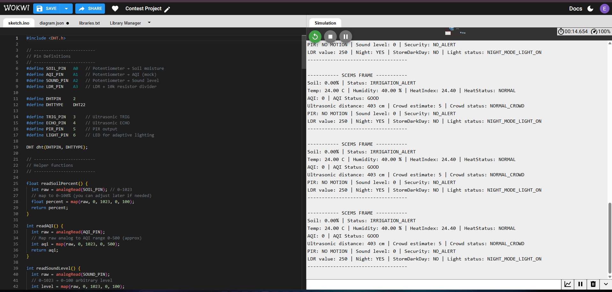
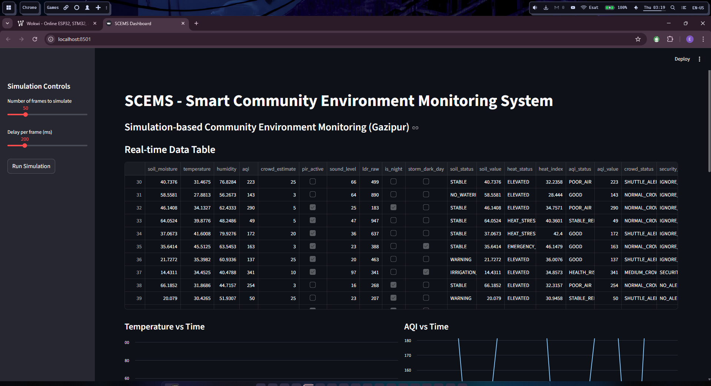
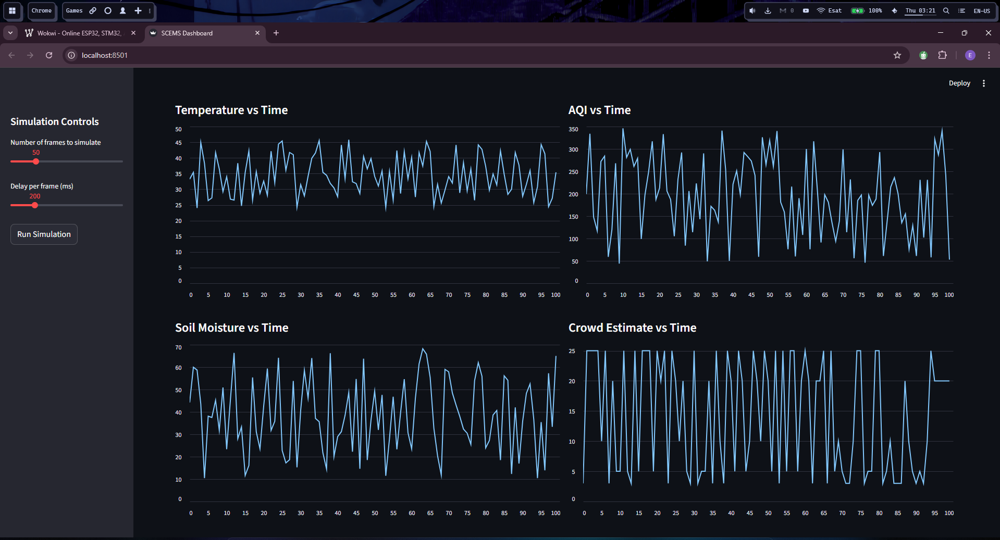
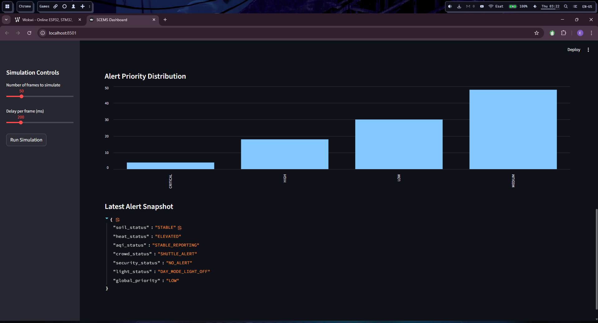

# Mst.Esat Jahan Akhi
# SCEMS – Smart Community Environment Monitoring System  
### Monthly IoT & Robotics Contest 2025 – Senior Category  
### Author: Mst. Esat Jahan Akhi  

---

## 1. Introduction

Gazipur’s Hi-Tech industrial zone faces major environmental and safety challenges:

- Poor air quality affecting workers  
- High temperature causing heat stress  
- Unstable soil moisture damaging community plantation areas  
- Overcrowded bus stands  
- Night-time security risks  
- Wasted energy due to manual street lighting

The **SCEMS (Smart Community Environment Monitoring System)** solves these through a **fully software-based multi-sensor simulation**, combining:

- Arduino/Wokwi virtual sensors  
- Python-based backend threshold engine  
- Real-time Streamlit dashboard  
- Historical logs for analytics  

This project uses **no physical hardware**, making it highly testable, scalable, and contest-friendly.

---

## 2. System Architecture

The complete architecture includes 3 major layers:

### **2.1 Sensor Simulation Layer (Arduino/Wokwi)**

Simulated sensors:

| Sensor / Input | Wokwi Component | Arduino Pin |
|----------------|----------------|-------------|
| Soil Moisture  | Potentiometer  | A0 |
| AQI (mock)     | Potentiometer  | A1 |
| Sound Level    | Potentiometer  | A2 |
| Ambient Light (LDR) | LDR + 10k resistor | A3 |
| Temperature & Humidity | DHT22 | D2 |
| Crowd Distance | HC-SR04 | D3 (TRIG), D4 (ECHO) |
| Motion Sensor | PIR | D5 |
| Adaptive Light Output | LED | D6 |

The Arduino code (`wokwi/code.ino`) generates a sensor frame every second and prints it in Serial Monitor.

---

### **2.2 Backend Processing Layer (Python)**

- `threshold_engine.py`  
  - Implements all threshold rules  
  - Soil / Heat / AQI / Crowd / Security / Lighting  
  - Generates global alert priority (CRITICAL / HIGH / MEDIUM / LOW)

- `sensors_simulation.py`  
  - Random realistic synthetic frames  
  - Matches Arduino sensor ranges  

- `log_to_csv.py`  
  - Generates historical CSV logs  
  - Saved in `logs/system_logs.csv`

---

### **2.3 Dashboard & Analytics Layer (Streamlit)**

- Displays real-time data table  
- Plots line charts: Temperature, Soil, AQI, Crowd  
- Shows Alert Priority Distribution  
- Shows latest alert snapshot (JSON)  
- Fully interactive simulation controls (frame count, speed)

---

## 3. Sensor Simulation Pipeline

Each frame includes:

- Soil moisture (%)  
- Temperature (°C)  
- Humidity (%)  
- AQI (0–500)  
- Crowd estimate (people count)  
- PIR motion (bool)  
- Sound level (0–100)  
- LDR raw value (0–1023)  
- Derived parameters → heat index, night flag, storm dark day flag  
- Evaluated statuses & priority levels  

---

## 4. Threshold Rules & Algorithms

| Sensor | Logic Implemented |
|-------|--------------------|
| Soil | Irrigation alert ≤ 15%, Warning ≤ 30%, No watering needed 50–60% |
| Temperature | Emergency ≥ 45°C, Heat Stress ≥ 36°C |
| Heat Index | Combined humidity factor if T ≥ 32°C & H ≥ 70% |
| AQI | Stable 40–80, Poor 180+, Health Risk 300+ |
| Crowd | Shuttle Alert ≥ 20, Normal ≤ 5 |
| Security | PIR + Sound > 60 → Alert (escalated at night) |
| Lighting | Night = LDR<300, Storm = LDR<400 at daytime |

---

## 5. Dashboard UI Flow & Analytics

Dashboard features:

- Live Data Table (last 20 frames)
- Temperature vs Time chart  
- Soil Moisture vs Time chart  
- AQI vs Time chart  
- Crowd Level vs Time chart  
- Alert Priority Distribution  
- Latest Alert Details (JSON)

### Screenshots

#### **Arduino/Wokwi Serial Output**


#### **Dashboard – Main View**


#### **Dashboard – Graphs**


#### **Alert Distribution**


---

## 6. Test Cases & Results

All Section A test cases were executed and verified using:

- Wokwi Serial Monitor  
- Streamlit dashboard  
- CSV log analysis  

Sample results are visible in:

- `system_logs.csv`  
- Dashboard charts  
- Wokwi frames  

---

## 7. Logs & Graphs

Historical logs generated using:

```
python backend/log_to_csv.py
```

Saved to:  
`logs/system_logs.csv`

Used for:

- Trend analysis  
- Report generation  
- Verification of threshold logic  
- Contest presentation  

---

## 8. Conclusion & Future Work

SCEMS successfully demonstrates:

- Complete multi-sensor environment monitoring  
- Real-time dashboard  
- Threshold-based alert system  
- A fully software-based IoT ecosystem  

### Future Scope

- AI/ML prediction for heat stress + AQI forecasting  
- Cloud integration for remote monitoring  
- Mobile app alert system  
- Community health analytics dashboard  

---

## 9. Links

- **GitHub Repository:**  
  https://github.com/Esatjahan/SCEMS-Environment-Monitoring

- **Wokwi Project:**  
  https://wokwi.com/projects/448685686274316289

- **Demo Video (Google Drive):**  
  https://drive.google.com/drive/folders/1hMPlVeWZghY3mUDQZwAU2zho7XbX1x9D?usp=drive_link

- **Final Report (PDF inside repo):**  
  docs/Final_Report/EsatJahan_SCEMS.pdf
